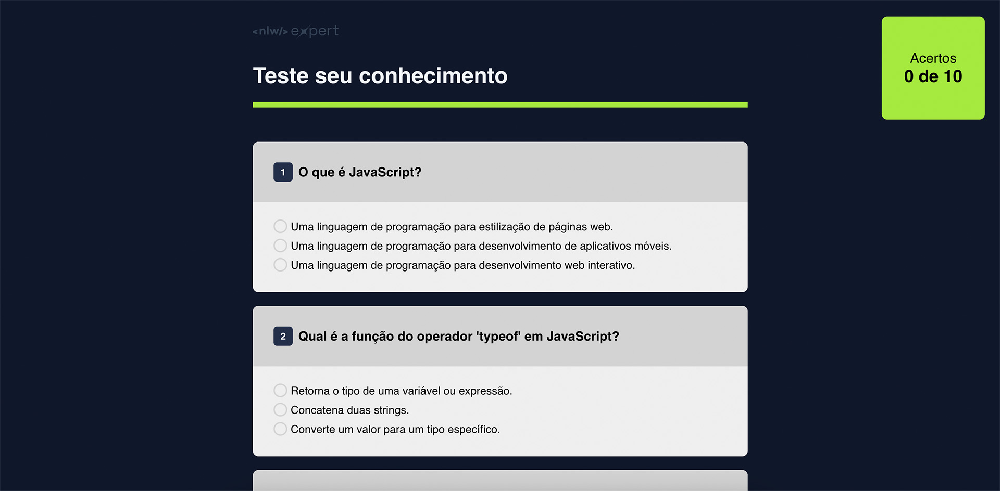

<h1 align="center">NLW Expert 02/2024 - RocketSeat - Projeto Quiz</h1>

Projeto desenvolvido no evento NLW Expert da Rocketseat, de uma aplicação simples HTML, CSS e JavaScript, de um quiz com uma lista de perguntas e respostas com um placar de acertos.

Veja o resultado <a href="" target="_blank">aqui.</a>

  <a href="#-tecnologias">Tecnologias</a>&nbsp;&nbsp;&nbsp;|&nbsp;&nbsp;&nbsp;
  <a href="#-projeto">Projeto</a>&nbsp;&nbsp;&nbsp;|&nbsp;&nbsp;&nbsp;
  <a href="#-layout">Layout</a>&nbsp;&nbsp;&nbsp;|&nbsp;&nbsp;&nbsp;
  <a href="#memo-licença">Licença</a>

  

 

  

## 🚀 Tecnologias

Esse projeto foi desenvolvido com as seguintes tecnologias:

- HTML e CSS
- JavaScript
- Git e Github

## 💻 Projeto

Uma aplicação em JavaScript com layout em HTML e CSS que cria um quiz com placar de acertos.

## :memo: Licença

Esse projeto está sob a licença MIT.

---

Feito com ♥ by Rocketseat/[rafaverde](https://github.com/rafaverde) :wave: [Participe da nossa comunidade!](https://discord.gg/rocketseat)

# Quiz

# NLW

# RocketSeat
